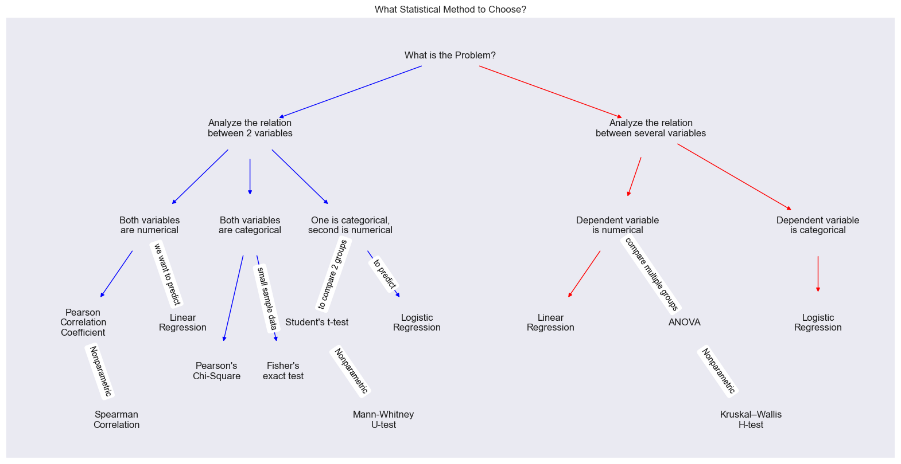

# Statistics With Python

Here's my [notebook](stats.ipynb) for Statistics with python implementation

### Table of Contents
- Statistics Summary
  - Types of Statistics
  - Population and Sample
  - Types of Variables
  - 4 levels of Variable Measurement
  - Plots
- Measure of Central Tendency
	- Mean
	- Median
	- Mode
- Measures of Variability
	- Dispersion
	- Range
	- Variance
	- Standard deviation

- Distribution Quantiles
	- Percentiles
	- Quantiles and Quartiles
	- Interquartile range
	- Outliers

- Normal Distribution
	- Probabilistic rule for Gaussian distribution
	- How to check if distribution is normal
	- z-score and z-table
	- Standardisation and Normalization

- Hypothesis Testing
	- Null Hypothesis and Alternative Hypothesis
	- Types of errors
	- p-value

- Central Limit Theorem
	- point estimate
	- standard mean error
- Z-Test
	- one-sample z-test
	- two-sample z-test
	- Confidence intervals

- Comparing Means
 	- T-Test
		- Student’s distribution
		- One-sample t-test
		- Two-sample t-test

    - ANOVA
	    - One-way ANOVA
	    - Sums of squares
		    - ss total
		    - ss within-group
		    - ss between-group
	    - Between-group variability
	    - Within-group variability
        - Fisher’s F-test
        - Bonferroni correction
        - Tukey HSD

    - Two-Way ANOVA

- Correlation
	- Correlation
	- Covariance
 	- Pearson correlation
	- Spearman Correlation

- Simple Linear Regression
	- One-way regression analysis
	- Regression line
	- Least square method
	- Coefficient of determination
	- Conditions to use linear regression

- Multiple Linear Regression
	- Adjusted R-squared
	- Conditions for multiple linear regression

- Categorical Data Analysis
    - Probability mass function
    - Bernoulli’s distribution
    - Binomial distribution
    - Chi-Square Test

    - Contingency Tables Analysis
        - Expected values
        - Observed values
        - Chi-Square for contingency table
        - Yates correction
        - Fisher’s exact test

    - Logistic Regression
        - odds and log odds
        - Intercept only model
        - Model with one categorical predictor
        - Model with two categorical predictors
        - Mixed regression model

- Nonparametric Methods
    - Wilcoxon signed-rank W-test
	- Mann–Whitney U-test
	- Kruskal–Wallis H-test

- Bonus!!!
	- K-Means Clustering

- Roadmap of Choosing Statistical Methods
